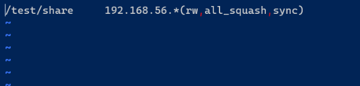
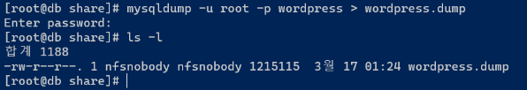
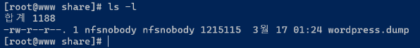

# 워드프레스 프로젝트

# 목차

1. 개요
   1. 목적
   2. 웹 서버(Apache, PHP, 워드프레스) 구성
   3. DB 서버(MariaDB) 구성
   4. DNS 서버 구성
2. 웹 서버 구축
   1. 웹 서버 호스트 네임 변경
   2. 네트워크 환경 세팅
   3. Apache 웹서버 설치
   4. 웹 서버 방화벽 설정
   5. PHP 설치
   6. 웹데몬 재실행
   7. 버전 확인
   8. 워드프레스 게시판 다운받기
   9. 워드프레스 구성
   10. httpd.conf 설정 변경
3. DB 서버 구축
   1. DB 서버 호스트 네임 변경
   2. 네트워크 환경 세팅 
   3. MariaDB 다운로드 
   4. mysql 기본 보안 세팅 
   5. mariadb 방화벽 설정 
   6. wordpress 에서 사용할 데이터베이스 설정
4. DNS 서버 구축 
   1. DNS 서버 호스트 네임 변경 
   2. 네트워크 환경 세팅 
   3. 정방향 DNS 구성 
   4. 웹 서버와 DB 서버에 DNS 설정 해주기 
   5. wordpress 설정 세팅 
   6. 워드프레스 시작하기 
   7. Error establishing a database connection
5. SSL 인증서 생성
   1. https 로 접속
6. NFS 설정
   1. NFS Server 구성(웹 서버에서 실행)
      1. 공유 디렉토리 생성
      2. exports 파일 작성
      3. nfs 설정 파일 편집
      4. nfs 방화벽 및 포트 추가
      5. nfs 서비스 시작 및 등록
   2. NFS 클라이언트 구성(DB 서버에서 실행)
      1. nfs 마운트 할 디렉토리 생성
      2. 생성한 디렉토리에 공유 디렉토리 마운트 
      3. 확인


# 개요

### 목적

Apache  + PHP + MariaDB 를 사용해서 게시판을 만들 것이다.

최종 목표는 총 3개의 가상 머신에 각각의 웹 서버(Apache, PHP, 워드프레스), DB 서버(MariaDB), DNS 서버를 띄워서 동작시키는 것이다.

워드프레스를 사용할 것이고 워드 프레스의 요구 사항으로는 PHP 7.4 이상, MariaDB 10.2 이상, Apache 또는 Nginx 사용이다.

즉, 각각 사용하려는 패키지의 버전을 잘 맞춰서 세팅을 해야한다.

### 웹 서버(Apache, PHP, 워드프레스) 구성

OS : CentOS 7

툴 : Virtual Box

네트워크 설정 

- enp0s8
    
    ipv4 : 192.168.56.115/24 
    gateway : 192.168.56.1
    
- enp0s3
    
    ipv4 : 10.0.2.100/24
    gateway : 10.0.2.2
    dns : 10.0.2.10
    

### DB 서버(MariaDB) 구성

OS : CentOS 7

툴 : Virtual Box

네트워크 설정

- enp0s8
    
    ipv4 : 192.168.56.30/24 
    gateway : 192.168.56.1
    
- enp0s3
    
    ipv4 : 10.0.2.200/24
    gateway : 10.0.2.2
    dns : 10.0.2.10
    

### DNS 서버 구성

OS : CentOS 7

툴 : Virtual Box

네트워크 설정 

- enp0s8
    
    ipv4 : 192.168.56.75/24 
    gateway : 192.168.56.1
    
- enp0s3
    
    ipv4 : 10.0.2.10/24
    gateway : 10.0.2.2
    dns : 10.0.2.10
    

# 웹 서버 구축

### 웹 서버 호스트 네임 변경

www.csw.exam.com 로 호스트 명을 변경한다. 후에 DNS 에서 사용할 것이다.


### 네트워크 환경 세팅

기본적으로 네트워크 환경을 세팅해줘야 yum 이나 외부 인터넷에 접근할 수 있다. 

$ nmcli con add 명령어를 통해 세팅할 수 있고, enp0s8 이나 enp0s9 인터페이스에 세팅을 해줘야 한다. enp0s3 는 내부용 인터페이스(브릿지)이다.

고정 IP 설정을 위해 아래처럼 설정해준다.

```bash
$ nmcli con add con-name static ifname enp0s8 type ethernet ip4 192.168.56.115/24 gw4 192.168.56.1

$ nmcli con up static
```

아직 DNS 서버가 구축되지 않았기 때문에 nslookup 이나 ping 명령어를 통해 도메인으로 핑을 보내거나 도메인 명으로 ip 를 확인할 수는 없다.

터미널을 열고 $ ssh root@192.168.56.115  으로 원격 접속을 할 수 있게 됐다.

### Apache 웹서버 설치

```bash
$ yum install httpd
```

### 웹 서버 방화벽 설정

```bash
$ firewall-cmd --add-service=http --add-service=https --permanent

$ firewall-cmd --reload

$ firewall-cmd --list-all
```

### PHP 설치

yum 을 사용해서 설치하면 5.4 버전이 설치되서 remi 와 yum-utils 로 버전을 변경한다!

$ yum install https://rpms.remirepo.net/enterprise/remi-release-7.rpm    →   remi 를 다운로드

$ yum install -y yum-utils   →  버전 변경을 위한 yum-utils 를 다운로드

$ yum-config-manager --disable remi-php54     →    php 5.4 버전 비활성화

$ yum-config-manager --enable remi-php74      →    php 7.4 버전 활성화

$ yum install php74      →    php 7.4 버전에 필요한 라이브러리 설치

$ yum install -y php74-php php-cli php74-scldevel \ \
php74-php-xml php74-php-xmlrpc php74-php-soap \ \
php74-php-process php74-php-pgsql php74-php-pdo \ \
php74-php-opcache php74-php-mbstring php74-php-ldap \ \
php74-php-json php74-php-ioncube-loader php74-php-intl \ \
php74-php-gmp php74-php-gd php74-php-fpm php74-php-devel \ \
php74-php-dba php74-php-common php74-php-cli \ \
php74-php-bcmath php74-php-phpiredis  php74-php-pecl-igbinary \ \
php74-php-pecl-imagick-im7 php74-php-pecl-imagick-im7-devel \ \
php74-php-pecl-igbinary-devel php74-php-pecl-geoip \ \
php74-php-pecl-xdebug php74-php-pecl-mysqlnd-azure

만약 yum 에러 시에 $ yum clean all 을 하여 기존 캐시 정보를 삭제하고 재설치하자.

### 웹데몬 재실행

php74 는 웹 데몬에 라이브러리처럼 작동한다.

```bash
$ systemctl restart httpd

$ systemctl status httpd
```

### 버전 확인

```bash
$ rpm -qa php74

$ rpm -qa httpd
```

### 워드프레스 게시판 다운받기

해당 [사이트](https://wordpress.org/support/article/how-to-install-wordpress/) 로 이동하여 어떻게 다운 받을지 확인할 수 있다.

wget 을 이용해서 https 를 통해 직접 다운로드를 받을 수 있고, 워드프레스 공식 홈페이지에서도 yum 보다는 wget 을 이용하여 다운 받는 것을 권장하고 있다.


$ yum install -y wget   →  wget 패키지 다운로드

$ cd ~

$ wget https://wordpress.org/latest.tar.gz

$ file latest.tar.gz    → 파일 확인

$ tar -xvzf latest.tar.gz -C /var/www/html     →  -C 옵션을 사용하여 해당 디렉토리에 압축 풀기

$ mkdir /var/www/html/wordpress/uploads     →  이미지나 동영상 같은 파일을 올릴 때 필요한 디렉토리 생성

### 워드프레스 구성

데이터베이스 서버와 연결할 수 있도록 설정을 해줘야 한다. 

접속할 데이터베이스의 IP 주소, 사용하려는 데이터베이스 이름, 유저 이름과 비밀번호를 세팅해준다.

$ ls -l /var/www/html/wordpress/wp-config-sample.php  →  샘플 설정 파일이다.

$ cd /var/www/html/wordpress 

$ cp wp-config-sample.php   wp-config.php    →   샘플 파일을 복사하여 새로운 설정 파일을 생성한다.

$ chown -R apache:apache  /var/www/html/wordpress    →    해당 워드프레스 디렉토리와 하위 모든 파일 및 디렉토리의 소유자, 소유그룹을 apache 로 변경한다.

### httpd.conf 설정 변경

httpd.conf 파일 내에 index.html 이 아니라 index.php 파일이 읽히도록 설정해줘야 한다.

vim /etc/httpd/conf/httpd.conf 로 이동한 뒤에 index.html 을 찾아서 index.php 로 변경한다.


# DB 서버 구축

### DB 서버 호스트 네임 변경

db.csw.exam.com 로 호스트 명을 변경한다. 후에 DNS 에서 사용할 것이다.


### 네트워크 환경 세팅

기본적으로 네트워크 환경을 세팅해줘야 yum 이나 외부 인터넷에 접근할 수 있다. 

$ nmcli con add 명령어를 통해 세팅할 수 있고, enp0s8 이나 enp0s9 인터페이스에 세팅을 해줘야 한다. enp0s3 는 내부용 인터페이스(브릿지)이다.

고정 IP 설정을 위해 아래처럼 설정해준다.

```bash
$ nmcli con add con-name static ifname enp0s8 type ethernet ip4 192.168.56.30/24 gw4 192.168.56.1

$ nmcli con up static
```

아직 DNS 서버가 구축되지 않았기 때문에 nslookup 이나 ping 명령어를 통해 도메인으로 핑을 보내거나 도메인 명으로 ip 를 확인할 수는 없다.

터미널을 열고 $ ssh root@192.168.56.30  으로 원격 접속을 할 수 있게 됐다.

### MariaDB 다운로드

MariaDB 10.1 이상 부터는 yum install 로 다운받지 못한다. 

해당 [사이트](https://mariadb.org/download/?t=repo-config&d=CentOS+7+(x86_64)&v=10.2&r_m=yongbok) 에 진입하면 CentOS7 (x86_64) 에서 10.2 버전 MariaDB 를 다운로드 할 수 있는 방법이 아래처럼 잘 나와있다.


/etc/yum.repo.d/MariaDB.repo 파일 안에 사진에 적힌 원문을 복사 붙여넣기 하면 된다. MariaDB 로 이름을 지었기 때문에 yum 을 통해 MariaDB 를 다운받을 수 있다.

아래 내용을 붙여넣자.

```bash
# MariaDB 10.2 CentOS repository list - created 2022-03-09 15:37 UTC
# https://mariadb.org/download/
[mariadb]
name = MariaDB
baseurl = https://mirror.yongbok.net/mariadb/yum/10.2/centos7-amd64
gpgkey=https://mirror.yongbok.net/mariadb/yum/RPM-GPG-KEY-MariaDB
gpgcheck=1
```

만약, 그전에 mariadb 를 다운받아 놓은 상태라면 $ yum remove mariadb 를 통해 구버전을 삭제한 후, $ yum info MairaDB-server 로 다운받을 버전을 확인, $ yum install -y MariaDB-server MariaDB-client 로 다운을 받는다.

만약 설치 중에 timeout 이 발생하면 yum 의 timeout 설정을 수정하자.

/etc/yum.conf 파일에 timeout 설정을 추가 또는 수정할 수 있다. 기본값은 30초이며 실패했을 때는 60초로 수정해주자.

```bash
[main]
keepcache=0
debuglevel=2
timeout=60
```

설치가 완료됐으면 $ rpm -qa MariaDB* 로 패키지 버전을 확인해주자 10.x.xx 버전이면 된다. 

$ rpm -ql MariaDB-server 명령어로 실행 파일, 데몬명을 확인할 수 있다.

$ systemctl start mariadb.service 로 mariadb 를 실행한다. 터미널에 아무런 변화나 텍스트가 발생하지 않았다면 오류가 발생한 것이 아니다.

$ systemctl enable mariadb.service 로 mariadb 를 활성화한다. 맨 처음 enable 을 했으면 심볼릭 링크를 만든다는 텍스트 메시지가 나올 것이다. 오류가 발생한 것이 아니다.

### mysql 기본 보안 세팅

$ mysql_secure_installation  명령어를 입력하여 mysql 기본 보안 세팅을 진행한다.

- 맨 처음 root 의 암호를 묻는데, 처음 root 의 비밀번호는 없다. 엔터를 누른다.
- root 암호 설정을 하겠냐고 묻는데 필수적으로 해준다. 비밀번호를 설정해준다.
- 원격 접속을 허용하지 않을 것이냐고 묻는데 웹서버와 DB 서버를 따로 할 경우에는 no, 하나의 가상 머신에서 web 서버와 db 서버가 같이 있을 경우에는 yes 를 해준다. 
웹서버와 DB 서버를 따로 하기 때문에 No 로 선택
- 비인가된 사용자들 접속을 허용하겠냐고 묻는데 no
- 테스트 용 데이터베이스를 삭제할 것인지 묻는데 yes
- 현재 세팅 값을 저장하겠냐고 묻는데 yes

$ mysql -u root -p 로 접속을 해보자.

기본적인 보안 세팅이 끝났고, 이 보안 세팅을 확인하고 싶으면 $ more /usr/bin/mysql_secure_installation 에서 확인할 수 있다.

### mariadb 방화벽 설정

가상 머신에 각각의 서비스를 따로 따로 설정한 경우 다른 가상머신에서 mariadb 서버로 접근할 수 있어야 되기 때문에 mariadb 의 기본 포트인 3307 포트를 열어줘야 한다.

```bash
$ firewall-cmd --zone=public --add-port=3306/tcp --permanent

$ firewall-cmd --reload

$ firewall-cmd --list-all
```

### wordpress 에서 사용할 데이터베이스 설정

$ mysql -u root -p 암호 입력

sql> CREATE DATABASE wordpress;    게시판 사용할 데이터베이스 생성

Query OK.   가 나오면 제대로 명령어 실행된 것이다!


sql> CREATE USER admin@’%’ IDENTIFIED BY '1234';   

sql> GRANT ALL PRIVILEGES ON wordpress.* TO admin@’%’ IDENTIFIED BY '1234';   

sql> FLUSH PRIVILEGES;  

sql> exit

처음 부터 차례차례 설명하자면, admin 유저를 생성하고 비밀번호는 1234 로 설정한다. 단, 호스트를 % 로 했기 때문에 모든 호스트에서 admin 유저에 접근을 할 수 있다.

해당 admin 유저에게 wordpress 데이터베이스의 모든 테이블에 대한 CRUD 권한을 주었다.

flush 명령어를 통해 해당 변경 사항을 저장했다.

# DNS 서버 구축

### DNS 서버 호스트 네임 변경

dns.csw.exam.com 로 호스트 명을 변경한다. 


### 네트워크 환경 세팅

기본적으로 네트워크 환경을 세팅해줘야 yum 이나 외부 인터넷에 접근할 수 있다. 

$ nmcli con add 명령어를 통해 세팅할 수 있고, enp0s8 이나 enp0s9 인터페이스에 세팅을 해줘야 한다. enp0s3 는 내부용 인터페이스(브릿지)이다.

고정 IP 설정을 위해 아래처럼 설정해준다.

```bash
$ nmcli con add con-name static ifname enp0s8 type ethernet ip4 192.168.56.75/24 gw4 192.168.56.1

$ nmcli con up static
```

enp0s3 세팅을 아래처럼 해준다.

```bash
$ nmcli con add con-name static3 ifname enp0s3 type ethernet ip4 10.0.2.10/24 gw4 10.0.2.2

$ nmcli con mod static3 ipv4.dns 10.0.2.10

$ nmcli con up static3
```

터미널을 열고 $ ssh root@192.168.56.75  으로 원격 접속을 할 수 있게 됐다.

### 정방향 DNS 구성

1. $ yum install -y bind bind-utils
2. $ vim /etc/named.conf
    1. options 에서 listen-on port 53 { any; }; 로 listen-on v6 port 53 { none; }; 으로 allow-query-cache { any; }; 로 수정한다.
    2. 맨 아래에 zone 을 추가해준다.
        
        ```bash
        zone "csw.exam.com" IN {
            type master;
            file "csw.exam.com.zone"; 
        };
        ```
        
3. $ cd /var/named,  $ cp named.empty  csw.exam.com.zone 

    a. $ vi csw.exam.com.zone 아래처럼 수정한다.  아래에 dns, www, db 로 시작하는 csw.exam.com 에 대한 ip 주소들을 세팅해준 것이다. (www.csw.exam.com, db.csw.exam.com, dns.csw.exam.com)
    
    
    
    b.  $ chmod 660 csw.exam.com.zone
          $ chown :named csw.exam.com.zone
          으로 csw.exam.com.zone 의 권한과 소유권 설정을 변경해줘야한다.
    
    c. $ systemctl start named
    
    d. $ firewall-cmd --add-service=dns --permanent
    
    e. $ firewall-cmd --reload
    
5. $ host www.csw.exam.com 을 치면 named.conf 에 입력해놓은 ip 주소인 192.168.56.30 을 리턴받는다.

### 웹 서버와 DB 서버에 DNS 설정 해주기

db 서버 돌리는 가상 머신으로 돌아가서 아래처럼 enp0s3 를 설정한다.


web 서버를 돌리는 가상 머신으로 돌아가서 아래처럼 enp0s3 를 설정한다.


### wordpress 설정 세팅

이제 /var/www/html/wordpress/wp-config.php 파일을 아래처럼 수정해준다. 

- DB_NAME 은 워드 프레스가 사용하려는 DB 이름이다.
- DB_USER 는 워드 프레스가 사용하려는 계정 이름이다.
- DB_PASSWORD 는 DB_USER 계정의 비밀번호이다.
- DB_HOST 는 DB 서버가 위치한 IP 주소나 도메인 명을 써주면 된다. db.csw.exam.com 말고 192.168.56.30 을 써도 작동한다.


### 워드프레스 시작하기

구글 창을 열고 웹 서버의 도메인 명을 치면 이상한 사이트로 이동한다. 이는 192.168.56.115 IP 주소가 해당 도메인으로 잡혀있지 않아서 그렇다.

www.csw.exam.com/wordpress 로 접속하기 위해서는 C:\Windows\System32\drivers\etc 로 들어와서 hosts 파일을 메모장을 통해서 연 뒤 내용을 수정해야 한다.


아래와 같이 수정한 후 저장을 한다.


www.csw.exam.com/wordpress 로 접속이 가능해진다.


### Error establishing a database connection

만약에 www.csw.exam.com/wordpress 로 접속 시 아래와 같은 오류가 발생한 경우


DB 서버와 웹 서버에서 setenforce 0 을 해줘야 한다.


둘 모두 setenforce 0 을 해줬다면 아래와 같이 잘 접속이 된다.


# SSL 인증서 생성

SSL 인증서를 생성하여 http 가 아니라 https 로 접속을 할 것이다.

1. $ yum install -y mod_ssl
2. $ openssl genrsa -out private.key 2048


3. $ openssl req -new -key private.key -out cert.csr

csr 은 Certificate Signing Request 의 약자로, 서버 인증서의 발급신청을 위해 인증기관에게 보낼 요청 파일이다. 이 csr 파일은 인증서에 설정할 서버의 정보와 개인 키와 짝을 이룰 공개 키 내용을 포함하고 있다.

- Country Name (2 letter code)
    - 2자로 약속된 국가 코드를 작성한다.
    - 대한민국은 **KR** 이다.
- State or Province Name (full name)
    - 주나 시이름을 작성한다.
- Locality Name (eg, city)
    - 구나 군이름을 작성한다.
    - ex) Seoul
- Organization Name (eg, company)
    - 기관명을 작성한다.
- Organizational Unit Name (eg, section)
    - 조직명을 작성한다.
    - ex) Dev
- Email Address
    - 이메일을 작성한다.


4. $ chmod 600 private.key cert.crt

생성된 key 파일, csr 파일, crt 파일 모두 아래에 지정된 경로에 저장해 둔다.

- /etc/pki/tls/private/  :  개인 키를 저장하는 디렉토리로, chmod 600 또는 400 으로 key 파일들 사용권한을 수정
- /etc/pki/tls/certs/  :  서명 요청할 때 생성되는 CA 로 보내는 파일들을 보낸다.(csr, 서명용 파일들)
- /etc/pki/tls/certs/  : 공개 인증서, 자체 서명된 인증서가 요청될 때만 서명 요청이 있고 CA로 전송될 때 CA 에서 반환되는 파일 chmod 644 로 crt 파일 권한 수정
5. $ mv private.key /etc/pki/tls/private/
6. $ mv cert.* /etc/pki/tls/certs/
7. $ vim /etc/httpd/conf.d/ssl.conf

```bash
<VirtualHost _default_:443>

DocumentRoot "/var/www/html"            =>  # 제거
ServerName server.test.example.com:443  =>  # 제거 후에 server.test.example.com:443 으로 변경

ErrorLog logs/ssl_error_log
TransferLog logs/ssl_access_log
LogLevel warn

SSLEngine on

SSLProtocol all -SSLv2 -SSLv3

SSLCipherSuite HIGH:3DES:!aNULL:!MD5:!SEED:!IDEA

SSLCertificateFile /etc/pki/tls/certs/localhost.crt        =>    cert.crt  으로 변경

SSLCertificateKeyFile /etc/pki/tls/private/localhost.key   =>    private.key 로 변경

```

### https 로 접속

https://www.csw.exam.com/wordpress 로 접속이 가능해졌다. 


만약 https 로 접속이 안된다면 https 서비스에 대한 방화벽을 열었는지 확인해야 한다.

$ firewall-cmd --list-all 

만약 https 서비스가 등록되어 있지 않다면 다음 처럼 서비스를 등록해준다.

$ firewall-cmd --add-service=https --permanent

$ firewall-cmd --reload


# NFS 설정

nfs 는 네트워크 파일 시스템의 약자로 쉽게 생각하면 같은 네트워크 내에서 사용할 수 있는 공유 디렉토리라고 보면 된다.

한 서버의 디렉토리를 nfs 로 지정한 후에 같은 네트워크 내의 호스트들이 디렉토리를 생성하고 해당 디렉토리를 nfs 로 마운트하면 그 디렉토리를 통해 데이터를 공유할 수 있다.

여기서는 웹 서버에서 /test/share 디렉토리를 생성한 후에 nfs 서버로 지정한 뒤, DB 서버에서 nfs 로 마운트 한 다음 wordpress 백업 파일을 공유할 것이다.

## NFS Server 구성(웹 서버에서 실행)
$ yum install -y nfs-utils  →  nfs 설정을 위한 패키지 설치
$ rpm -qa nfs*   →   nfs 패키지가 설치되었는지 확인

### 공유 디렉토리 생성
$ mkdir -p /test/share  →  다른 호스트에서 공유할 수 있는 공유 디렉토리 생성
$ chmod 767 /test/share  →  다른 사용자들이 해당 디렉토리에서 읽고, 쓰고, 실행할 수 있도록 권한 설정

### exports 파일 작성
$ vim /etc/exports  

설명하자면 /test/share  디렉토리를 192.168.56 네트워크의 모든 호스트들에게 공유하겠다는 뜻이다. 즉, 공유 디렉토리를 생성하겠다는 뜻이다.
$ exportfs -r  →   exports 변경사항 적용

### nfs 설정 파일 편집
/etc/sysconfig/nfs 파일을 수정해야 한다.

해당 파일을 열고 아래 서비스들 주석을 제거한다.

LOCKED_TCPPORT = 32803
LOCKED_UDPPORT = 32769
MOUNTD_PORT = 892
STATD_PORT = 662

### nfs 방화벽 및 포트 추가
tcp : 111, 892, 2049, 32803
$ firewall-cmd --add-service=111/tcp --permanent
$ firewall-cmd --add-service=892/tcp --permanent
$ firewall-cmd --add-service=2049/tcp --permanent
$ firewall-cmd --add-service=32803/tcp --permanent
udp : 111, 892, 2049, 32803
$ firewall-cmd --add-service=111/udp --permanent
$ firewall-cmd --add-service=892/udp --permanent
$ firewall-cmd --add-service=2049/udp --permanent
$ firewall-cmd --add-service=32769/udp --permanent

$ firewall-cmd --add-service=nfs  →  nfs 방화벽 추가

$ firewall-cmd --reload  →  방화벽 설정 리로드

### nfs 서비스 시작 및 등록

$ systemctl restart nfs-server
$ systemctl restart rpc-bind
$ systemctl restart nfs-lock
$ systemctl restart nfs-idmap

## NFS 클라이언트 구성(DB 서버에서 실행)

$ yum install -y nfs-utils

### nfs 마운트할 디렉토리 생성

$ mkdir -p /test/share

### 생성한 디렉토리에 공유 디렉토리를 마운트

$ mount -t nfs 192.168.56.115:/test/share  /test/share

설명하면 현재 DB 서버에 있는 /test/share 디렉토리에 192.168.56.115 서버에 있는 /test/share 디렉토리를 마운트 시킨다는 뜻이다.

쉽게 말해서 공유 디렉토리로 만든다는 뜻이다.

### 확인

DB 서버에 있는 wordpress 데이터베이스를 백업해서 공유 디렉토리에 저장하고 싶다.

$ cd /test/share
$ mysqldump -u root -p wordpress > wordpress.dump
$ ls -l
공유 디렉토리에 wordpress.dump 가 올라갔다.


웹 서버에서 해당 파일을 확인할 수 있고 사용할 수 있다.
이미지